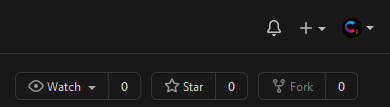

**Special Note:**
This repo is to be used as practice an getting used to a GitHub workflow. In order to begin working on this repo and trying to find your comfort in a GitHub workflow you should `fork` the repository. 

This is found in the top right of the screen

Selecting this button will give you options asking where you would like to fork the repo.  You can select from your account or any organization you have permission in.  This is different than how a classroom assignment is distributed.  Make sure to keep that in mind when going through this initial process.

This assignment outlined below is an example of what is given to students (it is not a perfect 1:1 to what students are given).

# Counting Fierce
>Backstory of assignment here for lore purposes.

## Objectives required to complete
This quest has us working with 

### Objective 1 - Creating a project board
Description on how to make a project board, template to select.

### Objective 2 - Designing a Plan 
Description of what is expected in a design plan

### Objective 3 - Cloning
Simple reminder to clone this repo into `IntelliJ` here.

### Objective 4 - Branching from the master
Description of how to branch from the `master` in `IntelliJ`.  Expectation is students have more than one branch when working on projects.  They merge branches into master at the end when submitting only the master branch is graded.

## Quest Requirements

### Objective 4 - Pushing
Reminder to push code from `IntelliJ` back to GitHub.  Another reminder to merge back into master before making the final push.

#### Grading
|   Points     |   Requirement    |
| :----------: |:---------------- |
| 2            | ZZZ              |
| 2            | YYY              |
